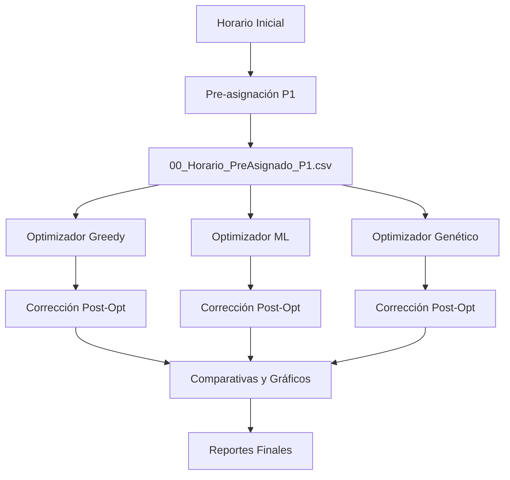

<!-- _class: lead invert -->
# Sistema de Asignación de Salones ISC

**Optimización Inteligente de Espacios Académicos**

**Jesús Olvera**

Ingeniería en Sistemas Computacionales
Instituto Tecnológico de Ciudad Madero

---

## Descripción General

Sistema inteligente de optimización para la asignación de salones en el programa de Ingeniería en Sistemas Computacionales.

**Objetivos:**
- ✅ Minimizar movimientos de profesores
- ✅ Reducir cambios de piso
- ✅ Optimizar distancias recorridas
- ✅ Garantizar cumplimiento de preferencias prioritarias

---

## 🎯 Sistema de Prioridades Jerárquico

**Tres niveles de prioridad:**

1. **PRIORIDAD 1 (Hard Constraint):** Preferencias de Profesores
   - Cumplimiento: **100% garantizado**
   - Implementación: Pre-asignación forzada
   - Protección: Clases inmutables durante optimización

2. **PRIORIDAD 2 (Soft Constraint):** Consistencia de Grupos
   - Mantener grupos en el mismo salón

3. **PRIORIDAD 3 (Soft Constraint):** Primer Semestre
   - Asignar grupos 15xx a salones específicos

---

## 🔧 Algoritmos de Optimización

**4 optimizadores diferentes:**

| Optimizador | Método | Tiempo | Características |
|-------------|--------|--------|-----------------|
| **Profesor** | Heurística simple | ~1s | Baseline de referencia |
| **Greedy + HC** | Voraz + búsqueda local | ~30s | Balance velocidad/calidad |
| **ML** | Random Forest + GB | ~16s | Aprende de horarios previos |
| **Genético** | Algoritmo evolutivo | ~74s | Mejor calidad, exploración amplia |

---

## Arquitectura del Sistema

```
Sistema-Salones-ISC/
├── configurador_materias.py      # Interfaz gráfica
├── pre_asignar_p1.py             # Pre-asignación P1
├── optimizador_greedy.py         # Greedy + Hill Climbing
├── optimizador_ml.py             # Machine Learning
├── optimizador_genetico.py       # Algoritmo Genético
├── corregir_prioridades.py       # Corrección post-opt
├── ejecutar_todos.py             # Script maestro
├── generar_comparativa_completa.py  # Reportes
├── utils_restricciones.py        # Validación
├── datos_estructurados/          # Datos I/O
└── comparativas/                 # Resultados
```

---

## Flujo de Ejecución



---

## Métricas de Optimización

**Función Objetivo** minimiza:

- **Movimientos de profesores:** Cambios de salón
- **Cambios de piso:** Subir/bajar escaleras
- **Distancia total:** Recorrido acumulado
- **Penalizaciones:** Violaciones de restricciones soft

---

## Resultados Típicos

| Optimizador | Tiempo | P1 | Movimientos | Cambios Piso | Distancia |
|-------------|--------|-----|-------------|--------------|--------------|
| Inicial     | -      | -   | 357         | 287          | 2847         |
| Profesor    | ~1s    | 95% | 320         | 250          | 2500         |
| **Greedy**  | ~30s   | **100%** | **314** | **206** | **1951** |
| ML          | ~16s   | 100% | 365         | 223          | 1821         |
| Genético    | ~74s   | 100% | 378         | 286          | 2413         |
