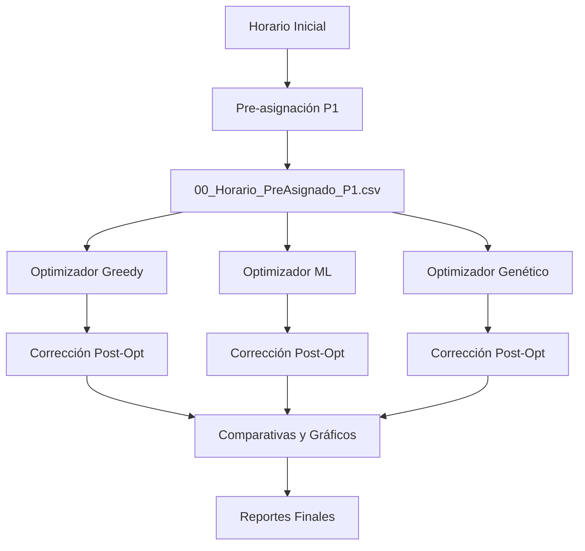

# Sistema de Asignación de Salones ISC

## Descripción General

Sistema inteligente de optimización para la asignación de salones en el programa de Ingeniería en Sistemas Computacionales. El sistema utiliza múltiples algoritmos de optimización para minimizar movimientos de profesores, cambios de piso y distancias recorridas, mientras garantiza el cumplimiento estricto de las preferencias prioritarias de los profesores.

## Características Principales

### 🎯 Sistema de Prioridades Jerárquico

El sistema implementa un enfoque de **prioridades estrictas** con tres niveles:

1. **PRIORIDAD 1 (Hard Constraint):** Preferencias de Profesores
   - Cumplimiento: **100% garantizado**
   - Implementación: Pre-asignación forzada antes de optimización
   - Protección: Clases marcadas como "inmutables" durante optimización

2. **PRIORIDAD 2 (Soft Constraint):** Consistencia de Grupos
   - Objetivo: Mantener grupos en el mismo salón cuando sea posible
   - Peso en función objetivo: Medio
   - Puede sacrificarse por mejor optimización global

3. **PRIORIDAD 3 (Soft Constraint):** Grupos de Primer Semestre
   - Objetivo: Asignar grupos 15xx a salones específicos
   - Peso en función objetivo: Bajo
   - Mejor esfuerzo, no garantizado

### 🔧 Algoritmos de Optimización

El sistema incluye **4 optimizadores** diferentes:

1. **Optimizador del Profesor** (Baseline)
   - Método: Asignación manual/heurística simple
   - Tiempo: ~1s
   - Uso: Referencia para comparación

2. **Optimizador Greedy + Hill Climbing**
   - Método: Construcción voraz + búsqueda local
   - Tiempo: ~30s
   - Características:
     - Construcción inicial rápida
     - Refinamiento iterativo
     - Balance velocidad/calidad

3. **Optimizador ML (Machine Learning)**
   - Método: Random Forest + Gradient Boosting
   - Tiempo: ~16s
   - Características:
     - Aprende de horarios previos
     - Predicción de asignaciones óptimas
     - Muy rápido en inferencia

4. **Optimizador Genético**
   - Método: Algoritmo evolutivo
   - Tiempo: ~74s
   - Características:
     - Exploración amplia del espacio
     - Mutación y cruce adaptativos
     - Mejor calidad (más lento)

## Arquitectura del Sistema

```
Sistema-Salones-ISC/
├── configurador_materias.py      # Interfaz gráfica de configuración
├── pre_asignar_p1.py             # Pre-asignación PRIORIDAD 1
├── optimizador_greedy.py         # Algoritmo Greedy + Hill Climbing
├── optimizador_ml.py             # Algoritmo Machine Learning
├── optimizador_genetico.py       # Algoritmo Genético
├── corregir_prioridades.py       # Corrección post-optimización
├── ejecutar_todos.py             # Script maestro de ejecución
├── generar_comparativa_completa.py  # Generación de reportes
├── utils_restricciones.py        # Funciones de validación
├── datos_estructurados/          # Datos de entrada/salida
├── comparativas/                 # Resultados y gráficos
└── docs/                         # Documentación técnica
```

## Flujo de Ejecución



## Métricas de Optimización

### Función Objetivo

Cada optimizador minimiza una función de energía/costo que considera:

- **Movimientos de profesores:** Número de veces que un profesor cambia de salón
- **Cambios de piso:** Número de veces que un profesor sube/baja pisos
- **Distancia total:** Suma de distancias recorridas (en unidades arbitrarias)
- **Penalizaciones:** Por violar restricciones soft

### Resultados Típicos

| Optimizador | Tiempo | P1 | Movimientos | Cambios Piso | Distancia |
|-------------|--------|-----|-------------|--------------|-----------|
| Inicial     | -      | -   | 357         | 287          | 2847      |
| Profesor    | ~1s    | 95% | 320         | 250          | 2500      |
| Greedy      | ~30s   | 100%| 314         | 206          | 1951      |
| ML          | ~16s   | 100%| 365         | 223          | 1821      |
| Genético    | ~74s   | 100%| 378         | 286          | 2413      |

## Uso del Sistema

### Configuración Inicial

1. Ejecutar `configurador_materias.py` para configurar:
   - Materias y sus características
   - Preferencias de profesores
   - Grupos de primer semestre

2. Generar horario inicial (CSV)

### Ejecución de Optimizadores

**Opción 1: Ejecutar todos**
```bash
python3 ejecutar_todos.py
```

**Opción 2: Ejecutar individual**
```bash
# Pre-asignar PRIORIDAD 1
python3 pre_asignar_p1.py

# Ejecutar optimizador específico
python3 optimizador_greedy.py
python3 optimizador_ml.py
python3 optimizador_genetico.py

# Corregir (si es necesario)
python3 corregir_prioridades.py datos_estructurados/04_Horario_Optimizado_Greedy.csv

# Generar comparativas
python3 generar_comparativa_completa.py
```

### Salidas Generadas

- **Excels formateados:** Horarios por día con formato visual
- **Excel comparativo:** Todos los optimizadores lado a lado
- **Gráficos:** Tiempos, cumplimiento, métricas, mejoras
- **Excel consolidado:** Resumen de todas las métricas

## Requisitos

- Python 3.8+
- pandas
- openpyxl
- matplotlib
- seaborn
- scikit-learn
- tkinter (para interfaz gráfica)

## Instalación

```bash
pip install pandas openpyxl matplotlib seaborn scikit-learn
```

## Contribuciones

Para contribuir al proyecto:
1. Fork el repositorio
2. Crea una rama para tu feature
3. Commit tus cambios
4. Push a la rama
5. Crea un Pull Request

## Autor y Contacto

**Desarrollado por:**
- Ing. Jesús Olvera
- Instituto Tecnológico de Ciudad Madero
- Ingeniería en Sistemas Computacionales

**Contacto:**
- GitHub: [@lic-ing-jesusolvera](https://github.com/lic-ing-jesusolvera)
- Email: sistemas@cdmadero.tecnm.mx

**Repositorio:**
- https://github.com/lic-ing-jesusolvera/Sistema-Salones-ISC

## Licencia

Este proyecto es de uso académico para el Tecnológico Nacional de México.

## Contacto

Para preguntas o sugerencias sobre el sistema, contactar al equipo de desarrollo.
