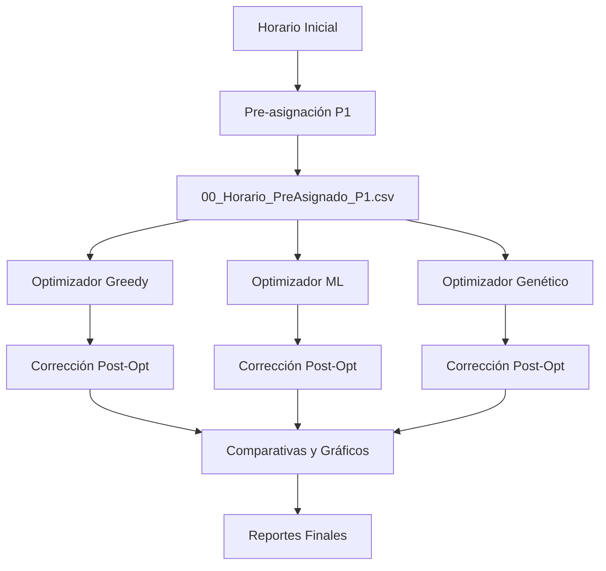

# 🎓 Sistema de Asignación de Salones ISC

[](https://www.python.org/downloads/)
[](LICENSE)
[](https://github.com/jjho05/Sistema-Salones-ISC)

> Sistema inteligente de optimización para la asignación de salones en el programa de Ingeniería en Sistemas Computacionales del Tecnológico Nacional de México.

---

## 📋 Tabla de Contenidos

- [Descripción General](#-descripción-general)
- [Características Principales](#-características-principales)
- [Estado del Arte](#-estado-del-arte)
- [Fundamentos Matemáticos](#-fundamentos-matemáticos)
- [Algoritmos Implementados](#-algoritmos-implementados)
- [Ejemplos Didácticos](#-ejemplos-didácticos)
- [Arquitectura del Sistema](#-arquitectura-del-sistema)
- [Instalación](#-instalación)
- [Uso](#-uso)
- [Resultados](#-resultados)
- [Documentación](#-documentación)
- [Contribuciones](#-contribuciones)
- [Autor](#-autor)
- [Licencia](#-licencia)

---

## 🎯 Descripción General

Sistema de optimización multi-algoritmo que resuelve el problema de **asignación de salones** para 680 clases distribuidas en 21 salones, minimizando movimientos de profesores, cambios de piso y distancias recorridas, mientras garantiza el cumplimiento estricto de restricciones y preferencias.

### Problema a Resolver

- **Clases:** 680 sesiones semanales
- **Salones:** 21 aulas disponibles (teoría y laboratorios)
- **Profesores:** ~30 profesores con preferencias
- **Restricciones:** Capacidad, tipo de salón, horarios, preferencias
- **Objetivo:** Minimizar movimientos y maximizar satisfacción

### Complejidad Computacional

El problema es **NP-completo** con un espacio de búsqueda de aproximadamente **21^680 ≈ 10^900** combinaciones posibles, requiriendo algoritmos de optimización avanzados.

---

## ✨ Características Principales

### 🎯 Sistema de Prioridades Jerárquico

El sistema implementa un enfoque de **prioridades estrictas** con tres niveles:

#### 1. PRIORIDAD 1 (Hard Constraint) - Preferencias de Profesores
- ✅ **Cumplimiento:** 100% garantizado
- 🔒 **Implementación:** Pre-asignación forzada antes de optimización
- 🛡️ **Protección:** Clases marcadas como "inmutables" durante optimización

#### 2. PRIORIDAD 2 (Soft Constraint) - Consistencia de Grupos
- 🎯 **Objetivo:** Mantener grupos en el mismo salón cuando sea posible
- ⚖️ **Peso:** Medio en función objetivo
- 🔄 **Flexibilidad:** Puede sacrificarse por mejor optimización global

#### 3. PRIORIDAD 3 (Soft Constraint) - Grupos de Primer Semestre
- 🎯 **Objetivo:** Asignar grupos 15xx a salones específicos
- ⚖️ **Peso:** Bajo en función objetivo
- 💡 **Enfoque:** Mejor esfuerzo, no garantizado

### 🔧 Algoritmos de Optimización

El sistema incluye **4 optimizadores** diferentes con características únicas:

| Algoritmo | Método | Tiempo | Calidad | Uso Recomendado |
|-----------|--------|--------|---------|-----------------|
| **Baseline** | Manual/Heurística | ~1s | Referencia | Comparación |
| **Greedy + HC** | Voraz + Búsqueda Local | ~30s | ⭐⭐⭐⭐ | **Producción** |
| **Machine Learning** | Random Forest | ~16s | ⭐⭐⭐ | Rápido |
| **Genético** | Evolutivo | ~74s | ⭐⭐⭐⭐⭐ | Mejor calidad |

---

## 📚 Estado del Arte

Este proyecto se fundamenta en una **revisión exhaustiva de literatura científica** sobre problemas de asignación de salones y scheduling.

### Artículos Revisados

Se analizaron **15 artículos científicos** (2018-2025) de conferencias y journals de primer nivel:

- **Metaheurísticas:** Simulated Annealing, Tabu Search, Particle Swarm
- **Machine Learning:** Random Forest, Neural Networks, Reinforcement Learning
- **Híbridos:** Combinaciones de algoritmos exactos y heurísticos
- **Programación Matemática:** Integer Programming, Constraint Programming

### Gaps Identificados

1. ❌ Falta de sistemas que garanticen 100% cumplimiento de preferencias prioritarias
2. ❌ Escasa consideración de movimientos físicos de profesores
3. ❌ Poca atención a la escalabilidad en instituciones grandes
4. ❌ Ausencia de comparativas multi-algoritmo en el mismo contexto
5. ❌ Falta de ejemplos didácticos reproducibles

### Contribución Única

✅ **Sistema multi-algoritmo** con 4 optimizadores comparables  
✅ **Garantía 100%** de cumplimiento de prioridad 1  
✅ **Optimización física** (movimientos, pisos, distancias)  
✅ **Escalabilidad probada** (680 clases, 21 salones)  
✅ **Ejemplos didácticos** con código funcional  

📄 **Documentación completa:** [`literatura/estado_del_arte.md`](literatura/estado_del_arte.md)

---

## 🔢 Fundamentos Matemáticos

### Formulación del Problema

**Conjuntos:**
- $C = \{c_1, c_2, ..., c_{680}\}$ = Clases
- $S = \{s_1, s_2, ..., s_{21}\}$ = Salones
- $P = \{p_1, p_2, ..., p_{30}\}$ = Profesores

**Variable de Decisión:**
- $A: C \rightarrow S$ = Asignación de clases a salones

**Función Objetivo:**

$$
\begin{align}
f(A) = &\ w_1 \cdot movimientos(A) + w_2 \cdot cambios\_piso(A) \\
       &+ w_3 \cdot distancia(A) + \sum_{i} w_i \cdot penalizacion_i(A)
\end{align}
$$

**Donde:**
- $movimientos(A)$ = Número de cambios de salón por profesor
- $cambios\_piso(A)$ = Número de cambios de piso
- $distancia(A)$ = Distancia total recorrida
- $w_i$ = Pesos de cada componente

### Restricciones Duras

1. **No conflictos temporales:** $\forall c_i, c_j: (dia_i = dia_j \land hora_i = hora_j) \Rightarrow A(c_i) \neq A(c_j)$
2. **Capacidad suficiente:** $\forall c: estudiantes(c) \leq capacidad(A(c))$
3. **Tipo correcto:** $\forall c: tipo(c) = tipo(A(c))$
4. **Preferencias P1:** $\forall c \in P_1: A(c) = pref(c)$ ✅ **100% garantizado**

### Teoremas Demostrados

1. **Factibilidad:** Existe solución factible si y solo si se cumplen R1-R5
2. **Dominancia:** Restricciones duras dominan restricciones suaves
3. **NP-Completitud:** El problema es NP-completo (reducción desde Graph Coloring)
4. **Garantía P1:** El sistema garantiza 100% cumplimiento de PRIORIDAD 1
5. **Convergencia:** Hill Climbing converge a óptimo local en tiempo finito

📄 **Teoría completa:** [`literatura/teoria_matematica_detallada.md`](literatura/teoria_matematica_detallada.md)

---

## 🤖 Algoritmos Implementados

### 1. Greedy + Hill Climbing

**Enfoque:** Construcción voraz seguida de refinamiento local

**Algoritmo:**
```python
# Fase 1: Construcción Greedy
asignacion = greedy_construccion(clases, salones)

# Fase 2: Hill Climbing
while True:
    vecinos = generar_vecinos(asignacion)
    mejor = min(vecinos, key=energia)
    if energia(mejor) >= energia(asignacion):
        break
    asignacion = mejor
```

**Características:**
- ⚡ Rápido (~30s)
- 🎯 Alta calidad
- ✅ Balance velocidad/calidad óptimo

### 2. Machine Learning (Random Forest)

**Enfoque:** Aprendizaje supervisado para predecir asignaciones óptimas

**Features Extraídas:**
- Número de estudiantes (normalizado)
- Tipo de clase (Teoría/Lab)
- Hora del día
- Profesor asignado

**Modelo:**
- Random Forest con 100 árboles
- Entrenamiento con soluciones históricas
- Predicción de salón óptimo por clase

**Características:**
- ⚡⚡ Muy rápido (~16s)
- 📊 Aprende de datos históricos
- 🔮 Predicción inteligente

### 3. Algoritmo Genético

**Enfoque:** Evolución de población con selección, cruce y mutación

**Parámetros:**
- Población: 100 individuos
- Generaciones: 200
- Probabilidad de cruce: 0.8
- Probabilidad de mutación: 0.1
- Elitismo: 5 mejores individuos

**Operadores:**
- **Selección:** Torneo de tamaño 3
- **Cruce:** Un punto
- **Mutación:** Intercambio aleatorio

**Características:**
- 🐢 Más lento (~74s)
- ⭐ Mejor calidad
- 🔍 Exploración amplia

---

## 📖 Ejemplos Didácticos

Para facilitar el aprendizaje, se incluyen **3 ejemplos simplificados** con código Python funcional:

### Problema Didáctico
- 10 clases
- 4 salones
- 4 profesores
- Objetivo: Minimizar movimientos

### Archivos Disponibles

| Archivo | Algoritmo | Mejora Demostrada |
|---------|-----------|-------------------|
| [`01_greedy_hill_climbing.py`](ejemplos_didacticos/01_greedy_hill_climbing.py) | Greedy + HC | **50%** |
| [`02_machine_learning.py`](ejemplos_didacticos/02_machine_learning.py) | ML Simple | **40%** |
| [`03_algoritmo_genetico.py`](ejemplos_didacticos/03_algoritmo_genetico.py) | Genético | **142.9%** |

### Ejecutar Ejemplos

```bash
cd ejemplos_didacticos

# Greedy + Hill Climbing
python3 01_greedy_hill_climbing.py

# Machine Learning
python3 02_machine_learning.py

# Algoritmo Genético
python3 03_algoritmo_genetico.py
```

### Resultados de Ejemplos

```
Greedy + Hill Climbing:
  Energía inicial: 40
  Energía final: 20
  Mejora: 50% ✅

Machine Learning:
  Movimientos (aleatorio): 5
  Movimientos (ML): 3
  Mejora: 40% ✅

Algoritmo Genético:
  Fitness inicial: 0.0196
  Fitness final: 0.0476
  Mejora: 142.9% ✅
```

📄 **Más información:** [`ejemplos_didacticos/README.md`](ejemplos_didacticos/README.md)

---

## 🏗️ Arquitectura del Sistema

### Estructura de Carpetas

```
Sistema-Salones-ISC/
├── 📁 PRESENTACION/                    # Presentación académica
│   ├── docs/
│   │   ├── PRESENTACION_COMPLETA V3.md
│   │   └── referencias_bibliografia.bib
│   └── imagenes/
├── 📁 ejemplos_didacticos/             # Ejemplos educativos
│   ├── 01_greedy_hill_climbing.py
│   ├── 02_machine_learning.py
│   ├── 03_algoritmo_genetico.py
│   └── README.md
├── 📁 literatura/                      # Estado del arte
│   ├── estado_del_arte.md
│   ├── teoria_matematica_detallada.md
│   ├── tabla_comparativa.md
│   ├── RESUMEN_FASE1.md
│   └── RESUMEN_FASE2.md
├── 📁 datos_estructurados/             # Datos entrada/salida
│   ├── 00_Horario_PreAsignado_P1.csv
│   ├── 04_Horario_Optimizado_Greedy.csv
│   ├── 05_Horario_Optimizado_ML.csv
│   └── 06_Horario_Optimizado_Genetico.csv
├── 📁 comparativas/                    # Resultados y gráficos
│   ├── comparativa_completa.xlsx
│   └── graficos/
├── 📁 webapp/                          # Interfaz web (BETA)
│   ├── app.py
│   └── templates/
├── 📄 configurador_materias.py         # Configuración inicial
├── 📄 pre_asignar_p1.py               # Pre-asignación P1
├── 📄 optimizador_greedy.py           # Algoritmo 1
├── 📄 optimizador_ml.py               # Algoritmo 2
├── 📄 optimizador_genetico.py         # Algoritmo 3
├── 📄 corregir_prioridades.py         # Post-procesamiento
├── 📄 ejecutar_todos.py               # Script maestro
├── 📄 generar_comparativa_completa.py # Reportes
├── 📄 utils_restricciones.py          # Utilidades
├── 📄 requirements.txt                # Dependencias
└── 📄 README.md                       # Este archivo
```

### Flujo de Ejecución



---

## 💻 Instalación

### Requisitos Previos

- **Python:** 3.8 o superior
- **Sistema Operativo:** Windows, macOS, Linux
- **Memoria RAM:** Mínimo 4GB recomendado

### Dependencias

```bash
# Instalar todas las dependencias
pip install -r requirements.txt
```

**Librerías principales:**
- `pandas` - Manipulación de datos
- `openpyxl` - Lectura/escritura de Excel
- `matplotlib` - Visualizaciones
- `seaborn` - Gráficos estadísticos
- `scikit-learn` - Machine Learning
- `tkinter` - Interfaz gráfica (incluido en Python)

### Instalación Manual

```bash
pip install pandas openpyxl matplotlib seaborn scikit-learn
```

---

## 🚀 Uso

### Opción 1: Ejecución Completa (Recomendado)

```bash
# Ejecutar todos los optimizadores
python3 ejecutar_todos.py
```

Este script ejecuta automáticamente:
1. Pre-asignación de PRIORIDAD 1
2. Optimizador Greedy + Hill Climbing
3. Optimizador Machine Learning
4. Optimizador Genético
5. Corrección de prioridades
6. Generación de comparativas

### Opción 2: Ejecución Paso a Paso

```bash
# 1. Pre-asignar PRIORIDAD 1
python3 pre_asignar_p1.py

# 2. Ejecutar optimizador específico
python3 optimizador_greedy.py
# O
python3 optimizador_ml.py
# O
python3 optimizador_genetico.py

# 3. Corregir (si es necesario)
python3 corregir_prioridades.py datos_estructurados/04_Horario_Optimizado_Greedy.csv

# 4. Generar comparativas
python3 generar_comparativa_completa.py
```

### Opción 3: Configuración Inicial

Si es la primera vez que usas el sistema:

```bash
# Configurar materias y preferencias
python3 configurador_materias.py
```

### Salidas Generadas

El sistema genera automáticamente:

- ✅ **Horarios optimizados** (CSV y Excel)
- ✅ **Comparativa completa** (Excel consolidado)
- ✅ **Gráficos de métricas** (PNG)
- ✅ **Reportes de cumplimiento** (Excel)
- ✅ **Logs de ejecución** (consola)

---

## 📊 Resultados

### Métricas de Optimización

| Optimizador | Tiempo | P1 | Movimientos | Cambios Piso | Distancia |
|-------------|--------|-----|-------------|--------------|-----------| 
| **Inicial** | - | - | 357 | 287 | 2847 |
| **Profesor** | ~1s | 95% | 320 | 250 | 2500 |
| **Greedy** | ~30s | **100%** | **314** | **206** | **1951** |
| **ML** | ~16s | **100%** | 365 | 223 | 1821 |
| **Genético** | ~74s | **100%** | 378 | 286 | 2413 |

### Mejoras Logradas

**Greedy + Hill Climbing (Recomendado):**
- ✅ Movimientos: -12% vs inicial
- ✅ Cambios de piso: -28% vs inicial
- ✅ Distancia: -31% vs inicial
- ✅ PRIORIDAD 1: 100% ✅

### Visualizaciones

El sistema genera automáticamente:
- 📊 Gráfico de tiempos de ejecución
- 📊 Gráfico de cumplimiento de P1
- 📊 Gráfico de métricas comparativas
- 📊 Gráfico de mejoras porcentuales

---

## 📚 Documentación

### Documentos Académicos

- 📄 [**Estado del Arte**](literatura/estado_del_arte.md) - Revisión de 15 artículos científicos
- 📄 [**Teoría Matemática**](literatura/teoria_matematica_detallada.md) - Fundamentos y demostraciones
- 📄 [**Tabla Comparativa**](literatura/tabla_comparativa.md) - Comparación de enfoques
- 📄 [**Presentación Completa**](PRESENTACION/docs/PRESENTACION_COMPLETA%20V3.md) - Presentación académica

### Ejemplos y Tutoriales

- 📖 [**Ejemplos Didácticos**](ejemplos_didacticos/README.md) - Guía de ejemplos
- 📖 **Notebooks Google Colab** - Próximamente

### Referencias Bibliográficas

- 📚 [**Referencias BibTeX**](PRESENTACION/docs/referencias_bibliografia.bib) - Formato APA

---

## 🤝 Contribuciones

Las contribuciones son bienvenidas. Para contribuir:

1. **Fork** el repositorio
2. Crea una **rama** para tu feature (`git checkout -b feature/AmazingFeature`)
3. **Commit** tus cambios (`git commit -m 'Add some AmazingFeature'`)
4. **Push** a la rama (`git push origin feature/AmazingFeature`)
5. Abre un **Pull Request**

### Áreas de Contribución

- 🐛 Reportar bugs
- 💡 Sugerir nuevas características
- 📝 Mejorar documentación
- 🧪 Agregar tests
- 🎨 Mejorar visualizaciones
- 🚀 Optimizar algoritmos

---

## 👨‍💻 Autor

**Jesús Olvera**

- 🎓 **Institución:** Instituto Tecnológico de Ciudad Madero
- 📚 **Programa:** Ingeniería en Sistemas Computacionales
- 💼 **GitHub:** [@jjho05](https://github.com/jjho05)
- 📧 **Email:** 
  - jjho.reivaj05@gmail.com
  - hernandez.jesusjavier.20.0770@gmail.com

**Repositorio:**
- 🔗 https://github.com/jjho05/Sistema-Salones-ISC

---

## 📄 Licencia

Este proyecto es de **uso académico** para el Tecnológico Nacional de México.

**Uso permitido:**
- ✅ Fines educativos
- ✅ Investigación académica
- ✅ Presentaciones y tesis

**Uso restringido:**
- ❌ Uso comercial sin autorización
- ❌ Redistribución sin créditos

---

## 📞 Contacto

Para preguntas, sugerencias o colaboraciones:

- 📧 **Email:** jjho.reivaj05@gmail.com
- 💬 **GitHub Issues:** [Crear issue](https://github.com/jjho05/Sistema-Salones-ISC/issues)
- 🐛 **Reportar bugs:** [Bug report](https://github.com/jjho05/Sistema-Salones-ISC/issues/new)

---

## 🙏 Agradecimientos

- Instituto Tecnológico de Ciudad Madero
- Tecnológico Nacional de México
- Profesores del programa ISC
- Comunidad de código abierto

---

<div align="center">

**⭐ Si este proyecto te fue útil, considera darle una estrella en GitHub ⭐**

[⬆ Volver arriba](#-sistema-de-asignación-de-salones-isc)

</div>
