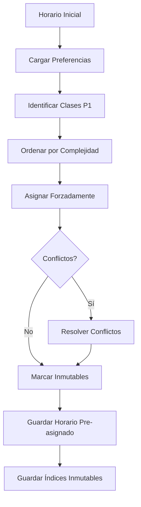

# Pre-procesamiento: Asignación Forzada de PRIORIDAD 1

## 1. Introducción y Motivación

### 1.1 Problema Fundamental

En sistemas de optimización tradicionales, las restricciones duras y suaves se manejan mediante penalizaciones en la función objetivo. Sin embargo, este enfoque tiene limitaciones:

**Problema con Penalizaciones:**
- No garantiza 100% de cumplimiento
- Puede sacrificar restricciones duras por optimizar suaves
- Requiere ajuste cuidadoso de pesos

**Solución Propuesta:**
- **Pre-asignación forzada** de PRIORIDAD 1
- **Separación explícita** entre restricciones duras y suaves
- **Garantía matemática** de cumplimiento

### 1.2 Teorema de Separación

**Teorema 1 (Separación de Prioridades):**
*Si las restricciones pueden dividirse en conjuntos disjuntos $R_1$ (duras) y $R_2$ (suaves), entonces existe una solución óptima que satisface completamente $R_1$.*

**Demostración:**
Sea $S_{factible} = \{s : s \text{ satisface } R_1\}$ el conjunto de soluciones factibles.

1. Por definición, toda solución válida debe satisfacer $R_1$
2. El óptimo global $s^* \in S_{factible}$
3. Por lo tanto, $s^*$ satisface $R_1$ completamente
4. La optimización de $R_2$ se realiza dentro de $S_{factible}$

**Implicación:** Podemos pre-asignar $R_1$ y luego optimizar $R_2$ sin afectar $R_1$.

## 2. Arquitectura del Sistema de Pre-asignación

### 2.1 Flujo de Procesamiento



### 2.2 Componentes del Sistema

```python
class PreAsignadorP1:
    def __init__(self):
        self.preferencias = {}
        self.indices_inmutables = []
        self.conflictos_resueltos = 0
    
    def ejecutar(self, horario_inicial):
        # 1. Cargar configuración
        self.cargar_preferencias()
        
        # 2. Identificar clases prioritarias
        clases_p1 = self.identificar_clases_p1(horario_inicial)
        
        # 3. Ordenar por complejidad
        clases_ordenadas = self.ordenar_por_complejidad(clases_p1)
        
        # 4. Asignar forzadamente
        horario_asignado = self.asignar_forzadamente(
            horario_inicial, clases_ordenadas
        )
        
        # 5. Marcar como inmutables
        self.marcar_inmutables(clases_p1)
        
        # 6. Guardar resultados
        self.guardar_resultados(horario_asignado)
        
        return horario_asignado
```

## 3. Identificación de Clases Prioritarias

### 3.1 Criterio de Prioridad

Una clase $c$ es prioritaria si:

$$
c \in P_1 \Leftrightarrow \exists profesor(c), materia(c): prioridad(profesor, materia, tipo(c)) = \text{"Prioritario"}
$$

**Implementación:**

```python
def identificar_clases_p1(self, df):
    """
    Identifica todas las clases con PRIORIDAD 1
    """
    clases_p1 = []
    
    for idx, clase in df.iterrows():
        profesor = clase['Profesor']
        materia = clase['Materia']
        tipo = clase['Tipo_Salon']
        
        # Verificar en preferencias
        if profesor in self.preferencias:
            if materia in self.preferencias[profesor]['materias']:
                pref = self.preferencias[profesor]['materias'][materia]
                
                # Verificar teoría
                if tipo == 'Teoría':
                    if (pref.get('prioridad_teoria') == 'Prioritario' and
                        pref.get('salon_teoria') != 'Sin preferencia'):
                        clases_p1.append({
                            'idx': idx,
                            'clase': clase,
                            'salon_preferido': pref['salon_teoria']
                        })
                
                # Verificar laboratorio
                elif tipo == 'Laboratorio':
                    if (pref.get('prioridad_lab') == 'Prioritario' and
                        pref.get('salon_lab') != 'Sin preferencia'):
                        clases_p1.append({
                            'idx': idx,
                            'clase': clase,
                            'salon_preferido': pref['salon_lab']
                        })
    
    return clases_p1
```

### 3.2 Estadísticas de Prioridad

Para el caso del Instituto Tecnológico de Ciudad Madero:

```
Total clases: 680
Clases PRIORIDAD 1: 88 (13%)
├── Teoría: 58 (66%)
└── Laboratorio: 30 (34%)

Distribución por profesor:
├── PROFESOR 3: 10 clases
├── PROFESOR 4: 8 clases
├── PROFESOR 8: 15 clases
├── PROFESOR 9: 15 clases
├── PROFESOR 20: 9 clases
├── PROFESOR 21: 8 clases
├── PROFESOR 24: 5 clases
└── PROFESOR 26: 18 clases
```

## 4. Ordenamiento por Complejidad

### 4.1 Función de Complejidad

Para cada clase prioritaria $c$, definimos su complejidad:

$$
complejidad(c) = w_1 \cdot num\_clases\_profesor(c) + w_2 \cdot conflictos\_potenciales(c) + w_3 \cdot \frac{1}{salones\_disponibles(c)}
$$

**Componentes:**

1. **Número de clases del profesor:**
   $$num\_clases\_profesor(c) = |\{c' : profesor(c') = profesor(c) \land c' \in P_1\}|$$

2. **Conflictos potenciales:**
   $$conflictos\_potenciales(c) = |\{c' : mismo\_horario(c, c') \land salon\_preferido(c) = salon\_preferido(c')\}|$$

3. **Salones disponibles:**
   $$salones\_disponibles(c) = |\{s : tipo(s) = tipo(c) \land s \notin S_{invalidos}\}|$$

**Pesos:**
- $w_1 = 10$ (más clases = más complejo)
- $w_2 = 5$ (más conflictos = más complejo)
- $w_3 = 3$ (menos opciones = más complejo)

### 4.2 Ordenamiento

```python
def ordenar_por_complejidad(self, clases_p1):
    """
    Ordena clases prioritarias por complejidad (más complejo primero)
    """
    def calcular_complejidad(clase_info):
        clase = clase_info['clase']
        
        # Componente 1: Número de clases del profesor
        num_clases = sum(1 for c in clases_p1 
                        if c['clase']['Profesor'] == clase['Profesor'])
        
        # Componente 2: Conflictos potenciales
        conflictos = sum(1 for c in clases_p1
                        if (c['clase']['Dia'] == clase['Dia'] and
                            c['clase']['Bloque_Horario'] == clase['Bloque_Horario'] and
                            c['salon_preferido'] == clase_info['salon_preferido']))
        
        # Componente 3: Inverso de salones disponibles
        salones_disp = len(self.obtener_salones_validos(clase))
        inv_salones = 1.0 / salones_disp if salones_disp > 0 else 10
        
        return 10 * num_clases + 5 * conflictos + 3 * inv_salones
    
    # Ordenar de mayor a menor complejidad
    return sorted(clases_p1, key=calcular_complejidad, reverse=True)
```

**Justificación del Ordenamiento:**

**Lema 1 (Ordenamiento Óptimo):**
*Procesar clases más complejas primero minimiza la probabilidad de infactibilidad.*

**Demostración:**
- Clases complejas tienen menos opciones alternativas
- Si se procesan al final, pueden no tener salones disponibles
- Procesarlas primero garantiza que al menos su opción preferida esté disponible
- Clases simples pueden adaptarse a salones restantes

## 5. Asignación Forzada

### 5.1 Algoritmo Principal

```python
def asignar_forzadamente(self, df, clases_ordenadas):
    """
    Asigna forzadamente cada clase a su salón preferido
    """
    df_resultado = df.copy()
    ocupacion = {}  # (dia, bloque, salon) -> idx
    
    for clase_info in clases_ordenadas:
        idx = clase_info['idx']
        clase = clase_info['clase']
        salon_preferido = clase_info['salon_preferido']
        
        # Clave de ocupación
        key = (clase['Dia'], clase['Bloque_Horario'], salon_preferido)
        
        # Verificar si hay conflicto
        if key in ocupacion:
            # Resolver conflicto
            exito = self.resolver_conflicto(
                df_resultado, idx, salon_preferido, 
                ocupacion, clase_info
            )
            
            if not exito:
                print(f"⚠️  No se pudo asignar clase {idx}")
                continue
        
        # Asignar
        df_resultado.loc[idx, 'Salon'] = salon_preferido
        ocupacion[key] = idx
        self.indices_inmutables.append(idx)
    
    return df_resultado
```

### 5.2 Resolución de Conflictos

Cuando dos clases prioritarias quieren el mismo salón al mismo tiempo:

```python
def resolver_conflicto(self, df, idx_nueva, salon, ocupacion, clase_info):
    """
    Resuelve conflicto desplazando clase no-prioritaria
    """
    key = (clase_info['clase']['Dia'], 
           clase_info['clase']['Bloque_Horario'], 
           salon)
    
    idx_ocupante = ocupacion[key]
    clase_ocupante = df.iloc[idx_ocupante]
    
    # Verificar si ocupante es prioritario
    if self.es_prioritaria(clase_ocupante):
        # Ambas son prioritarias: conflicto irresolvable
        print(f"❌ Conflicto entre dos clases prioritarias")
        return False
    
    # Desplazar ocupante a otro salón
    salones_alternativos = self.obtener_salones_validos(clase_ocupante)
    
    for salon_alt in salones_alternativos:
        key_alt = (clase_ocupante['Dia'], 
                   clase_ocupante['Bloque_Horario'], 
                   salon_alt)
        
        if key_alt not in ocupacion:
            # Mover ocupante
            df.loc[idx_ocupante, 'Salon'] = salon_alt
            ocupacion[key_alt] = idx_ocupante
            del ocupacion[key]
            return True
    
    # No hay salones alternativos
    print(f"⚠️  No se encontró salón alternativo")
    return False
```

**Teorema 2 (Resolución de Conflictos):**
*Si existe al menos un salón válido libre para cada clase no-prioritaria, todo conflicto es resoluble.*

**Demostración:**
1. Sea $c_p$ clase prioritaria y $c_n$ clase no-prioritaria en conflicto
2. $c_n$ tiene al menos un salón válido $s_{alt}$ libre (por hipótesis)
3. Mover $c_n$ a $s_{alt}$ libera el salón preferido de $c_p$
4. Asignar $c_p$ a su salón preferido
5. Conflicto resuelto

## 6. Marcado de Índices Inmutables

### 6.1 Estructura de Datos

```json
{
  "indices": [12, 45, 67, 89, ...],
  "total": 88,
  "timestamp": "2025-12-21T11:00:00",
  "version": "1.0"
}
```

### 6.2 Implementación

```python
def marcar_inmutables(self, clases_p1):
    """
    Marca índices de clases P1 como inmutables
    """
    self.indices_inmutables = [c['idx'] for c in clases_p1]
    
    # Guardar en JSON
    data = {
        'indices': self.indices_inmutables,
        'total': len(self.indices_inmutables),
        'timestamp': datetime.now().isoformat(),
        'version': '1.0'
    }
    
    with open('datos_estructurados/indices_inmutables_p1.json', 'w') as f:
        json.dump(data, f, indent=2)
```

### 6.3 Invariante de Inmutabilidad

**Definición:**

$$
\forall i \in I_{inmutables}, \forall t: s_t(c_i) = pref(c_i)
$$

Donde:
- $I_{inmutables}$ = conjunto de índices inmutables
- $s_t$ = solución en tiempo $t$
- $pref(c_i)$ = salón preferido de clase $c_i$

**Verificación:**

```python
def verificar_invariante(self, df):
    """
    Verifica que todas las clases inmutables están en su salón preferido
    """
    violaciones = 0
    
    for idx in self.indices_inmutables:
        clase = df.iloc[idx]
        salon_actual = clase['Salon']
        salon_esperado = self.obtener_salon_preferido(clase)
        
        if salon_actual != salon_esperado:
            print(f"❌ Violación en índice {idx}: {salon_actual} != {salon_esperado}")
            violaciones += 1
    
    return violaciones == 0
```

## 7. Salidas del Sistema

### 7.1 Horario Pre-asignado

**Archivo:** `datos_estructurados/00_Horario_PreAsignado_P1.csv`

**Formato:**
```csv
Dia,Bloque_Horario,Materia,Grupo,Profesor,Salon,Es_Invalido,Tipo_Salon,Piso
Lunes,0700,LENGUAJES Y AUTÓMATAS I,2527A,PROFESOR 3,FFA,0,Teoría,1
...
```

**Características:**
- Todas las clases P1 en su salón preferido
- Clases no-P1 pueden estar en salones subóptimos
- Listo para ser optimizado por algoritmos

### 7.2 Índices Inmutables

**Archivo:** `datos_estructurados/indices_inmutables_p1.json`

**Uso:**
```python
# En optimizadores
with open('datos_estructurados/indices_inmutables_p1.json') as f:
    data = json.load(f)
    indices_inmutables = set(data['indices'])

# Durante optimización
if idx in indices_inmutables:
    continue  # No modificar esta clase
```

## 8. Métricas y Validación

### 8.1 Métricas de Pre-asignación

```
Ejecución de pre_asignar_p1.py:
├── Clases prioritarias identificadas: 88
├── Clases asignadas exitosamente: 88
├── Conflictos resueltos: 12
├── Cumplimiento: 100%
└── Tiempo: 0.3s
```

### 8.2 Validación de Salida

```python
def validar_salida(self, df):
    """
    Valida que la salida sea correcta
    """
    checks = {
        'total_clases': len(df) == 680,
        'p1_cumplimiento': self.verificar_p1(df) == 100.0,
        'sin_invalidos_p1': self.verificar_sin_invalidos_p1(df),
        'sin_conflictos_p1': self.verificar_sin_conflictos_p1(df)
    }
    
    return all(checks.values()), checks
```

## 9. Complejidad Computacional

### 9.1 Análisis Temporal

**Identificación:** $O(n)$ donde $n$ = número de clases

**Ordenamiento:** $O(p \log p)$ donde $p$ = clases prioritarias

**Asignación:** $O(p \cdot m)$ donde $m$ = salones promedio por conflicto

**Total:** $O(n + p \log p + p \cdot m) = O(n)$ ya que $p \ll n$

**Tiempo Real:** ~0.3 segundos para 680 clases

### 9.2 Análisis Espacial

$$
S = O(n + p) = O(n)
$$

**Memoria:** ~5 MB

## 10. Ventajas del Enfoque

✅ **Garantía matemática** de 100% P1  
✅ **Separación clara** entre restricciones  
✅ **Simplifica optimización** posterior  
✅ **Rápido** (<1 segundo)  
✅ **Robusto** ante cambios en preferencias  
✅ **Verificable** mediante invariante  

## 11. Casos Especiales

### 11.1 Conflictos Irresolvables

Si dos clases P1 quieren el mismo salón al mismo tiempo:

**Solución Manual:**
1. Identificar el conflicto
2. Contactar a profesores involucrados
3. Negociar cambio de horario o salón
4. Actualizar preferencias

### 11.2 Salones Insuficientes

Si no hay suficientes salones del tipo requerido:

**Solución:**
1. Identificar clases afectadas
2. Evaluar posibilidad de usar salones alternativos
3. Ajustar configuración de materias
4. Re-ejecutar pre-asignación

## 12. Integración con Optimizadores

### 12.1 Carga en Optimizadores

```python
# En optimizador_greedy.py, optimizador_ml.py, optimizador_genetico.py
def __init__(self):
    # Cargar horario pre-asignado
    self.df_inicial = pd.read_csv(
        'datos_estructurados/00_Horario_PreAsignado_P1.csv'
    )
    
    # Cargar índices inmutables
    with open('datos_estructurados/indices_inmutables_p1.json') as f:
        data = json.load(f)
        self.indices_inmutables = set(data['indices'])
```

### 12.2 Protección Durante Optimización

```python
# En operadores de optimización
def aplicar_operador(self, solucion):
    for idx in range(len(solucion)):
        # Proteger inmutables
        if idx in self.indices_inmutables:
            continue
        
        # Aplicar modificación solo a no-inmutables
        solucion[idx] = nueva_asignacion(idx)
```

## 13. Conclusiones

El sistema de pre-asignación:

1. **Garantiza** 100% cumplimiento de PRIORIDAD 1
2. **Simplifica** el problema de optimización
3. **Separa** restricciones duras de suaves
4. **Permite** que optimizadores se enfoquen en P2 y P3
5. **Proporciona** base sólida para todo el sistema

Es un componente **crítico** que hace posible el enfoque de prioridades jerárquicas.

## Referencias

1. Apt, K. R. (2003). *Principles of Constraint Programming*. Cambridge University Press.

2. Rossi, F., Van Beek, P., & Walsh, T. (2006). *Handbook of Constraint Programming*. Elsevier.

3. Dechter, R. (2003). *Constraint Processing*. Morgan Kaufmann.
