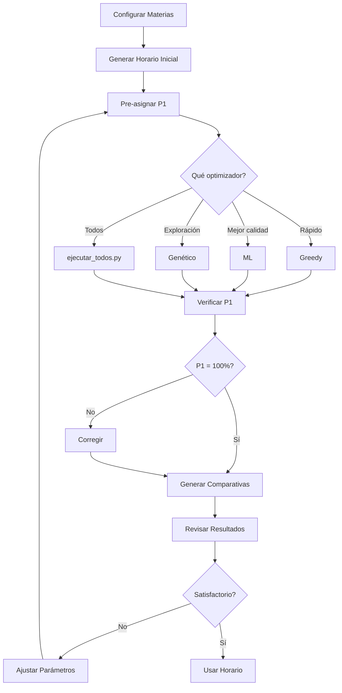

# Guía de Uso del Sistema

## Instalación

### Requisitos Previos

- Python 3.8 o superior
- pip (gestor de paquetes de Python)

### Instalación de Dependencias

```bash
cd Sistema-Salones-ISC
pip install -r requirements.txt
```

Si no existe `requirements.txt`, instalar manualmente:

```bash
pip install pandas openpyxl matplotlib seaborn scikit-learn
```

## Configuración Inicial

### 1. Configurar Materias y Preferencias

Ejecutar la interfaz gráfica:

```bash
python3 configurador_materias.py
```

**Pasos:**
1. Configurar cada materia (horas teoría/lab, distribución)
2. Asignar preferencias de profesores (salón preferido + prioridad)
3. Configurar grupos de primer semestre
4. Guardar configuración

### 2. Generar Horario Inicial

El horario inicial debe ser un CSV con las siguientes columnas:

```
Dia,Bloque_Horario,Materia,Grupo,Profesor,Salon,Es_Invalido,Tipo_Salon,Piso
```

**Ejemplo:**
```csv
Lunes,0700,FUNDAMENTOS DE PROGRAMACIÓN,1527A,PROFESOR 34,FF1,0,Teoría,0
Lunes,0800,FUNDAMENTOS DE PROGRAMACIÓN,1527A,PROFESOR 34,FF1,0,Teoría,0
```

Guardar como: `datos_estructurados/01_Horario_Inicial.csv`

## Ejecución

### Opción 1: Ejecutar Todo Automáticamente

```bash
python3 ejecutar_todos.py
```

Este script ejecuta:
1. Pre-asignación PRIORIDAD 1
2. Optimizador Greedy
3. Corrección Greedy
4. Optimizador ML
5. Corrección ML
6. Optimizador Genético
7. Corrección Genético
8. Generación de comparativas

**Tiempo estimado:** ~2-3 minutos

### Opción 2: Ejecutar Paso por Paso

#### Paso 1: Pre-asignar PRIORIDAD 1

```bash
python3 pre_asignar_p1.py
```

**Salida:**
- `datos_estructurados/00_Horario_PreAsignado_P1.csv`
- `datos_estructurados/indices_inmutables_p1.json`

#### Paso 2: Ejecutar Optimizador Específico

```bash
# Greedy (rápido, buena calidad)
python3 optimizador_greedy.py

# ML (muy rápido, excelente calidad)
python3 optimizador_ml.py

# Genético (lento, exploración amplia)
python3 optimizador_genetico.py
```

**Salidas:**
- `datos_estructurados/04_Horario_Optimizado_Greedy.csv`
- `datos_estructurados/05_Horario_Optimizado_ML.csv`
- `datos_estructurados/06_Horario_Optimizado_Genetico.csv`

#### Paso 3: Corregir (Opcional)

```bash
python3 corregir_prioridades.py datos_estructurados/04_Horario_Optimizado_Greedy.csv
```

#### Paso 4: Generar Comparativas

```bash
python3 generar_comparativa_completa.py
```

**Salidas:**
- Excels formateados en `comparativas/`
- Gráficos en `comparativas/final/graficos/`
- Excel consolidado en `comparativas/final/`

## Interpretación de Resultados

### Archivos Generados

#### 1. Excels Formateados (Por Optimizador)

**Ubicación:** `comparativas/XX_inicial_vs_YYY/Horario_Optimizado_YYY.xlsx`

**Formato:**
- Columna A: Grupo + Materia
- Columnas B-F: Lunes a Viernes
- Cada celda: Horario + Salón

**Uso:** Ver horario específico de cada optimizador

#### 2. Excel Comparativo (Todos)

**Ubicación:** `comparativas/final/Comparativa_Todos_Optimizadores.xlsx`

**Formato:**
- Columna A: Grupo + Materia
- Columna B: Optimizador (Inicial, Profesor, Greedy, ML, Genético)
- Columnas C-G: Lunes a Viernes

**Uso:** Comparar fácilmente todos los optimizadores grupo por grupo

#### 3. Excel Consolidado

**Ubicación:** `comparativas/final/Comparativa_Completa.xlsx`

**Hojas:**
- **Resumen:** Métricas de todos los optimizadores
- **Inicial, Profesor, Greedy, ML, Genético:** Datos completos

**Uso:** Análisis cuantitativo de métricas

#### 4. Gráficos

**Ubicación:** `comparativas/final/graficos/`

- `01_tiempos_ejecucion.png`: Tiempo de cada optimizador
- `02_cumplimiento_prioridad1.png`: Cumplimiento P1 (100%)
- `03_comparativa_metricas.png`: Movimientos, cambios piso, distancia
- `04_mejora_porcentual.png`: Mejora vs horario inicial

### Métricas Clave

#### Cumplimiento PRIORIDAD 1

**Objetivo:** 100%

**Interpretación:**
- 100%: ✅ Todas las preferencias prioritarias cumplidas
- <100%: ❌ Algunas preferencias no cumplidas (requiere corrección)

#### Movimientos de Profesores

**Definición:** Número de cambios de salón por profesor

**Ejemplo:**
- Profesor tiene clases en FF1, FF2, FF1, FF3
- Movimientos = 3 (FF1→FF2, FF2→FF1, FF1→FF3)

**Objetivo:** Minimizar

#### Cambios de Piso

**Definición:** Número de veces que un profesor sube/baja pisos

**Ejemplo:**
- Clases en FF1 (piso 0), FF8 (piso 1), FF2 (piso 0)
- Cambios = 2

**Objetivo:** Minimizar

#### Distancia Total

**Definición:** Suma de distancias entre salones consecutivos

**Cálculo:**
- Mismo salón: 0
- Mismo piso: 1
- Diferente piso: 10

**Objetivo:** Minimizar

## Solución de Problemas

### Error: "No se encontró el archivo"

**Causa:** Archivo de entrada no existe

**Solución:**
```bash
# Verificar que existe el horario inicial
ls datos_estructurados/01_Horario_Inicial.csv

# Si no existe, generarlo o copiarlo
```

### Error: "PRIORIDAD 1 no al 100%"

**Causa:** Conflictos en preferencias o salones insuficientes

**Solución:**
1. Ejecutar `corregir_prioridades.py`
2. Verificar preferencias en `preferencias_profesores.json`
3. Revisar disponibilidad de salones

### Optimizador muy lento

**Causa:** Parámetros muy altos (especialmente Genético)

**Solución:**
Editar parámetros en el optimizador:

```python
# optimizador_genetico.py
optimizador = OptimizadorGenetico(
    tam_poblacion=15,      # Reducir de 150
    num_generaciones=100,  # Reducir de 500
    ...
)
```

### Resultados inconsistentes

**Causa:** Aleatoriedad en algoritmos

**Solución:**
Fijar semilla aleatoria:

```python
import random
random.seed(42)
```

## Personalización

### Modificar Pesos de Optimización

Editar en cada optimizador:

```python
# optimizador_greedy.py
self.pesos = {
    'movimientos': 10,      # Aumentar para priorizar
    'cambios_piso': 5,
    'distancia': 3,
    ...
}
```

### Agregar Nuevas Restricciones

1. Editar `utils_restricciones.py`
2. Agregar función de validación
3. Integrar en función objetivo

### Cambiar Formato de Salida

Editar `generar_comparativa_completa.py`:

```python
def generar_excel_formato(csv_file, output_file):
    # Modificar formato aquí
    ...
```

## Mejores Prácticas

### 1. Siempre Ejecutar Pre-asignación

```bash
# SIEMPRE ejecutar esto primero
python3 pre_asignar_p1.py
```

### 2. Verificar Cumplimiento P1

Después de cada optimización:

```bash
python3 corregir_prioridades.py datos_estructurados/XX_Horario.csv
```

### 3. Comparar Múltiples Ejecuciones

El algoritmo genético puede dar resultados diferentes:

```bash
# Ejecutar varias veces y comparar
for i in {1..5}; do
    python3 optimizador_genetico.py
    mv datos_estructurados/06_Horario_Optimizado_Genetico.csv \
       datos_estructurados/06_Horario_Optimizado_Genetico_$i.csv
done
```

### 4. Respaldar Configuraciones

```bash
# Antes de cambios importantes
cp preferencias_profesores.json preferencias_profesores.json.bak
cp configuracion_materias.json configuracion_materias.json.bak
```

## Flujo de Trabajo Recomendado



## Contacto y Soporte

Para preguntas o problemas:
1. Revisar esta documentación
2. Consultar `docs/` para detalles técnicos
3. Contactar al equipo de desarrollo
